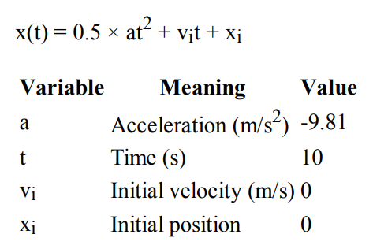

# Practice

# Exercise #1 

Write a Java program to accept two integers and return true if the either one is 15 or if their sum or difference is 15.

# Exercise #2

Write a program called CheckOddEven which prints "Odd Number" if the int variable “number” is odd, or “Even Number” otherwise. The program shall always print “bye!” before exiting.

# Exercise #3 

See [SumAverageRunningInt.java](./SumAverageRunningInt.java)

Write a program called SumAverageRunningInt to produce the sum of 1, 2, 3, ..., to 100. Store 1 and 100 in variables lowerbound and upperbound, so that we can change their values easily. Also compute and display the average. The output shall look like:

```
The sum of 1 to 100 is 5050
The average is 50.5
```

# Exercise #4

Write a program called Product1ToN to compute the product of integers from 1 to 10 (i.e., 1×2×3×...×10), as an int. Take a note that it is the same as factorial of N.

# Exercise #5

Write a program that picks a random number from 1-100. Give the user a chance to guess it. If they get it right, tell them so. If their guess is higher than the number, say "Too high." If their guess is lower than the number, say "Too low." Then quit. (They don't get any more guesses for now.)

```
I'm thinking of a number between 1-100.  Try to guess it.
> 13

Sorry, you are too low.  I was thinking of 34.
```

```
I'm thinking of a number between 1-100.  Try to guess it.
> 79

Sorry, you are too high.  I was thinking of 51.
```

```
I'm thinking of a number between 1-100.  Try to guess it.
> 42

You guessed it!  What are the odds?!?
```

# Exercise #6

Write a program called CozaLozaWoza which prints the numbers 1 to 110, 11 numbers per line. The program shall print "Coza" in place of the numbers which are multiples of 3, "Loza" for multiples of 5, "Woza" for multiples of 7, "CozaLoza" for multiples of 3 and 5, and so on. The output shall look like:

```
1 2 Coza 4 Loza Coza Woza 8 Coza Loza 11 
Coza 13 Woza CozaLoza 16 17 Coza 19 Loza CozaWoza 22 
23 Coza Loza 26 Coza Woza 29 CozaLoza 31 32 Coza
```

# Exercise #7

See [GravityCalculator.java](./GravityCalculator.java)

Modify the example program to compute the position of an object after falling for 10 seconds, outputting the position in
meters. The formula in Math notation is:



*Note:* The correct value is -490.5m.

# Exercise #8

Foo Corporation needs a program to calculate how much to pay their hourly employees. The US Department of Labor
requires that employees get paid time and a half for any hours over 40 that they work in a single week. For example, if an
employee works 45 hours, they get 5 hours of overtime, at 1.5 times their base pay. The State of Massachusetts requires
that hourly employees be paid at least $8.00 an hour. Foo Corp requires that an employee not work more than 60 hours in
a week. 

## Summary

 - An employee gets paid (hours worked) × (base pay), for each hour up to 40 hours.
 - For every hour over 40, they get overtime = (base pay) × 1.5.
 - The base pay must not be less than the minimum wage ($8.00 an hour). If it is, print an error.
 - If the number of hours is greater than 60, print an error message.

Write a method that takes the base pay and hours worked as parameters, and prints the total pay or an error. Write a main
method that calls this method for each of these employees:

| Employee | Base Pay | Hours Worked |
| --- | --- | --- |
| Employee 1 | $7.50 | 35 |
| Employee 2 | $8.20 | 47 |
| Employee 3 | $10.00 | 73 |

# Exercise #9

Write a program that calculates and displays a person's body mass index (BMI). A person's BMI is calculated with the following formula: ```BMI = weight x 703 / height ^ 2```. Where weight is measured in pounds and height is measured in inches. Display a message indicating whether the person has optimal weight, is underweight, or is overweight. A sedentary person's weight is considered optimal if his or her BMI is between 18.5 and 25. If the BMI is less than 18.5, the person is considered underweight. If the BMI value is greater than 25, the person is considered overweight.

Your program must accept metric units.

# Exercise #10

See [CalculateArea.java](./CalculateArea.java)

Design a Geometry class with the following methods:

- A static method that accepts the radius of a circle and returns the area of the circle. Use the following formula:
  - Area = π * r * 2
  - Use Math.PI for π and r for the radius of the circle
- A static method that accepts the length and width of a rectangle and returns the area of the rectangle. Use the following formula:
  - Area = Length x Width
- A static method that accepts the length of a triangle’s base and the triangle’s height. The method should return the area of the triangle. Use the following formula:
  - Area = Base x Height x 0.5
  
The methods should display an error message if negative values are used for the circle’s radius, the rectangle’s length or width, or the triangle’s base or height.

Next write a program to test the class, which displays the following menu and responds to the user’s selection:

```
Geometry calculator:

Calculate the Area of a Circle
Calculate the Area of a Rectangle
Calculate the Area of a Triangle
Quit
Enter your choice (1-4):
```

Display an error message if the user enters a number outside the range of 1 through 4 when selecting an item from the menu.