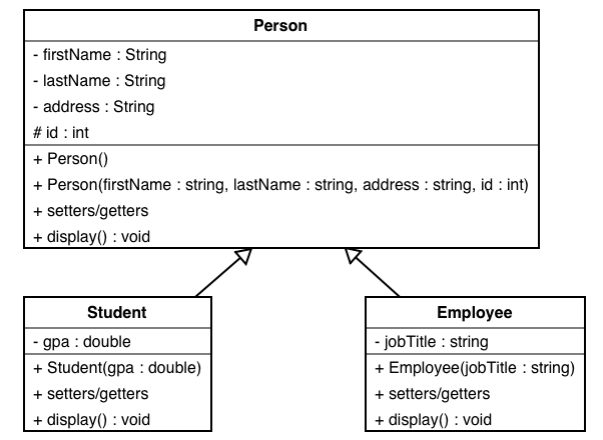
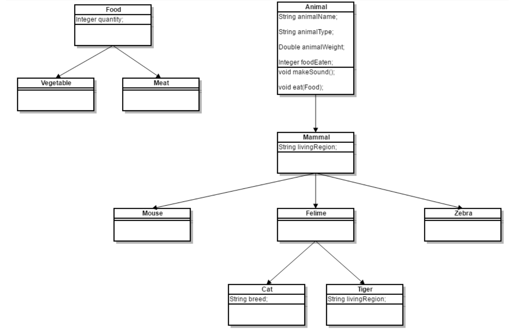

# Practice

## Group exercise

Think about the real world objects below, how you would design them?

### Animals

  - Eagle
  - Dog
  - Cat
  - Mouse
  - Rat
  - Owl
  - Shark
  - Dolphin
  - Tuna
  - German Shephard
  - Korgi
  - Tiger
  - Lion
  - Butterfly
  - Crocodile

### Employees

  - Accountant
  - Volunteer
  - Intern
  - Developer
  - Marketing specialist
  - Courier
  - Designer
  - Teacher
  - Hairdresser
  - Freelancer

### Advertisements

  - Billboard
  - TV ad
  - Website banner
  - Facebook ad
  - Radio ad
  - Instagram ad
  - Newspaper ad

### Vehicles

  - Bicycle
  - Motorbike
  - Car
  - Toyota
  - Lexus
  - BMW
  - School bus
  - Train

### Food

  - Apple
  - Salad
  - Soup
  - Maasdam Cheese
  - Mushroom soup
  - Orange
  - Meat
  - Burger
  - Pasta
  - Rice
  - Snickers
  - Cheese 
  - Avocado
  - Ice cream
  - CocaCola
  - Water
  - Muesli

### Countries

  - Latvia
  - Lithuania
  - Russia
  - USA
  - Canada
  - Sweden
  - Switzerland
  - Norway
  - Germany
  - Australia
  - Japan
  - China

## Exercise #1

See [exercise1/DragRace.java](./exercise1/DragRace.java)

## Exercise #2

See [exercise2/MakeSounds.java](./exercise2/MakeSounds.java)

Scenario: We have the idea that an object could also be associated with a Sound, which can be played when requested by a client program. We can capture this behaviour in an interface class. We will model the sound with a String description.

Create two more classes:

  - Parrot
  - Radio
  
Then add few instances of each type in the list and make sounds while iterating over them.

# Exercise #3

Write Java code to implement the following inheritance hierarchy:



The two sub classes Student and Employee should override display() method.
 
In Student, display() should show GPA and the other attributes in the super class. And in Employee, display() should show the job title and the other attributes in the super class.

Write a main program that should do the following:

  - Create an instant of class Student and an instant of class Employee with proper values for the attributes.
  - Display the content of each class using display() method.

## Exercise #4

See [exercise4/Firm.java](./exercise4/Firm.java)

The program illustrates inheritance and polymorphism. In this exercise you will add one more employee type to the class hierarchy. The employee will be one that is an hourly employee but also earns a commission on sales. Hence the class, which we'll name Commission, will be derived from the Hourly class.

Write a class named Commission with the following features:

  - It extends the Hourly class.
  - It has two instance variables (in addition to those inherited): one is the total sales the employee has made (type double)
and the second is the commission rate for the employee (the commission rate will be type double and will represent the
percent (in decimal form) commission the employee earns on sales (so .2 would mean the employee earns 20%
commission on sales)).
  - The constructor takes 6 parameters: the first 5 are the same as for Hourly (name, address, phone number, social security
number, hourly pay rate) and the 6th is the commission rate for the employee. The constructor should call the constructor
of the parent class with the first 5 parameters then use the 6th to set the commission rate.
  - One additional method is needed: public void addSales (double totalSales) that adds the parameter to the instance
variable representing total sales.
  - The pay method must call the pay method of the parent class to compute the pay for hours worked then add to that the
pay from commission on sales. (See the pay method in the Executive class.) The total sales should be set back to 0 (note:
you don't need to set the hoursWorked back to 0—why not?).
  - The toString method needs to call the toString method of the parent class then add the total sales to that.
  
To test your class, update Staff.java as follows:

  - Increase the size of the array to 8.
  - Add two commissioned employees to the staffList - make up your own names, addresses, phone numbers and social
security numbers. Have one of the employees earn $6.25 per hour and 20% commission and the other one earn $9.75 per
hour and 15% commission.
  - For the first additional employee you added, put the hours worked at 35 and the total sales $400; for the second, put the
hours at 40 and the sales at $950.

Compile and run the program. Make sure it is working properly.

## Exercise #5

Scenario: An advertising campaign consists of a set of advertisements. Adverts can be of several types, for example:
a roadside Hoarding, a Newsapaper ad, TV commercial, or Poster. Each type of advert has a cost associated with it: a
fixed fee to cover materials, production staff and media costs, and variable costs for buying advertising time and
space.

An advertising campaign consists of one or more advert-events:

  - A Hoarding for a poster is hired for a number of days. The standard cost is £H per hoarding. An additional
surcharge of 50% is charged for prime locations.
  - Newspaper: The cost is £N per column cm.
  - TV commercial: Air time is sold by the seconds. The standard cost is £T per second, which doubles at peak
times.

Create another subclass of Advert, e.g. a Poster, which may have attributes such as dimensions, number
of copies and cost per copy. Add it in the AdApp.

## Exercise #6

Your task is to create a class hierarchy like the picture below. All the classes except Vegetable, Meat, Mouse,
Tiger, Cat & Zebra should be abstract.



Input should be read from the console. Every even line will contain information about the Animal in following format:

```
{AnimalType} {AnimalName} {AnimalWeight} {AnimalLivingRegion} [{CatBreed} = Only if its cat]
```

On the odd lines you will receive information about the food that you should give to the Animal. The line will consist of FoodType and quantity separated by a whitespace.

You should build the logic to determine if the animal is going to eat the provided food. The Mouse and Zebra should check if the food is a Vegetable. If it is they will eat it. Otherwise you should print a message in the format:

```
{AnimalType} are not eating that type of food!
```

Cats eat any kind of food, but Tigers accept only Meat. If Vegetable is provided to a tiger message like the one above should be printed on the console.

After you read information about the Animal and Food then invoke makeSound() method of the current animal and then feed it. At the end print the whole object and proceed reading information about the next animal/food. The input will continue until you receive “End”. After that print the information of all received animals in format:

```
{AnimalType} [{AnimalName}, {CatBreed}, {AnimalWeight}, {AnimalLivingRegion}, {FoodEaten}]
```

Print all animal weight with no trailing zeroes after the decimal separator. Use the DecimalFormat class.

Note: consider overriding toString() method.

Example:

```
Cat Gray 1.1 Home Persian
> Meowwww
Vegetable 4
> Cat[Gray, Persian, 1.1, Home, 4]
Tiger Typcho 167.7 Asia
> ROAAR!!!
Vegetable 1
> Tigers are not eating that type of food!
End
> Cat[Gray, Persian, 1.1, Home, 4], Tiger[Typcho, 167.7, Asia, 0]
```